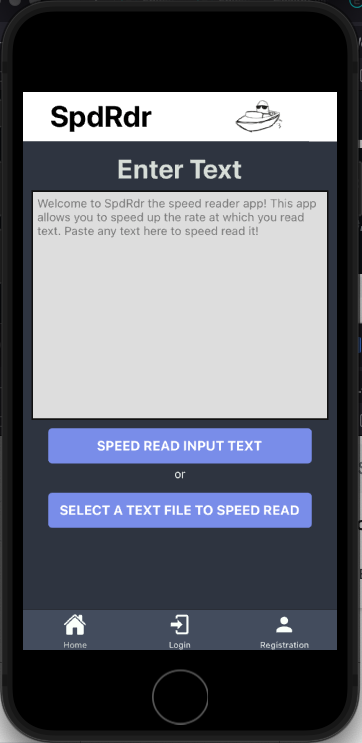
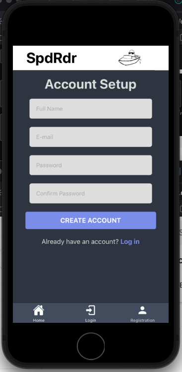
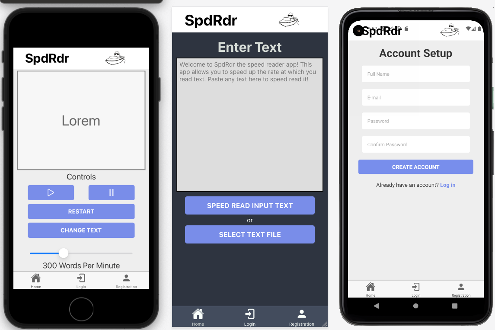

# SpdRdr

SpdRdr is an application used to increase the rate at which you read text on your device of choice: iOS, Android, and web! Simply paste text into the input or select a text file on your device to start speed reading. Use the handy slider to set the speed at which the app displays a single word of text on the screen. You can range anywhere from 100 to 3000 words per minute!

This is primarily built for mobile devices but there is a web app build available at http://spdrdr.surge.sh. Try it out!

App is awaiting approval to be available on the Google Play Store. Stay tuned!

---

## App Screen Examples

### Android

### iPhone

### iPhone, Web, and Android

---

## Requirements To Build It Locally

1. [NodeJs](https://nodejs.org/en/)
2. [Npm](https://www.npmjs.com/) or [Yarn](https://yarnpkg.com/)
3. [Expo](https://docs.expo.io/get-started/installation/)
4. A browser such as [Firefox](https://www.mozilla.org/en-US/firefox/new/), Android Emulator (such as via Android Studio), or iOS device simulator program (such as Xcode).

---

## Installation

1. Clone this repository `git clone https://github.com/Usarneme/speed_reader`
2. Enter the project directory `cd speed_reader`
3. Install all dependencies `yarn install` or `npm install`
4. Run the application `yarn web`
5. Open the LAN address as shown in your terminal in your browser of choice

---

## Tech Stack

1. React Native
2. Expo
3. Babel
4. Webpack
5. JavaScript and JSX
6. React Native Stylesheets
7. Firebase + Firestore For User Accounts, Auth, and Data Storage
8. Redux

---

## License

GPLv3

---

## Known Issues

1. None at this time. Please open a pull request if any are found.

---

## Research and App Planning

[Research.md](Research.md)

---

## Copyright

&copy; 2021 Tom/Usarneme
